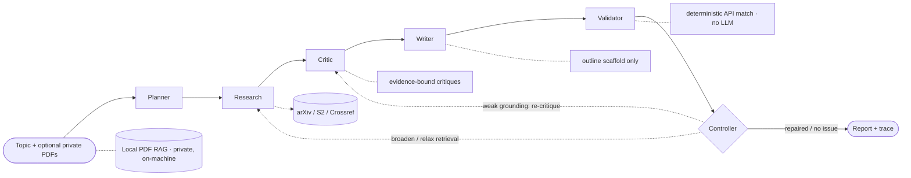

# Athena Research Assistant

> Multi-agent research copilot that **separates LLM generation from deterministic verification** to fight citation hallucination in scholarly literature review.

[](https://github.com/2u39u4/ResearchFlow/actions/workflows/ci.yml)


Athena retrieves real papers from scholarly APIs, generates **evidence-grounded** gap analysis and outline scaffolding, and then verifies every citation **without an LLM in the matching logic** — so bibliographic claims are machine-checkable, not hallucinated. It is a *research-assistance* tool with an academic-integrity banner in the UI, **not** an essay or paper ghostwriter.

The core design bet — evaluated below on a public benchmark — is that **generation should be creative but verification should be deterministic**.

## Results at a glance

| Question | Result | Significance |
|----------|--------|--------------|
| Citation hallucination detection (HALLMARK `dev_public`, **full N=1119**) | **F1-H 0.747** · detection 0.776 · tier-weighted F1 0.813 | beats `doi_only` 0.373; see [breakdown](docs/evaluation/hallmark_full.md) |
| Pipeline fake-citation rate | 27.8% (all) → **0%** (verified-only policy) | deterministic filter |
| Multi-agent vs single-agent literature coverage | **0.855 vs 0.787** (+6.8 pp) | paired *t*-test *p* ≈ 4.4×10⁻⁵ |
| Blind pairwise preference (multi vs single) | 53.3% | **not** significant (*p* ≈ 0.70) — reported honestly |
| Blind human eval (n=12) | preferred multi-agent **11/12**; multi deeper (4.83 vs 4.17) | **diverges** from the LLM judge — evidence of judge verbosity bias |
| Critic evidence-grounding rate | **1.000** | by construction |

Numbers come from 60 matched runs per RQ (20 topics × 3 repeats). A **committed, read-only snapshot** of the statistics and figures lives in [`docs/evaluation/`](docs/evaluation/) so you can verify them without re-running the multi-hour experiments. Full method and caveats: [`docs/TECHNICAL_REPORT.md`](docs/TECHNICAL_REPORT.md).

### Key research insight: the LLM judge is biased against multi-agent verbosity

The evaluation surfaced a result more interesting than a leaderboard win. Adding the Critic forced **evidence grounding to 1.000**, yet the LLM judge scored the *no-Critic* path **deeper** (RQ2, *p* ≈ 0.007) — counterintuitive if you assume more structure means more depth. The blind human study (n=12) then **reversed the judge**: the human rated multi-agent deeper (4.83 vs 4.17) and preferred it in **11/12** items, exactly where the LLM judge preferred single-agent. The takeaway: **the LLM-as-judge penalizes the repetitive, corpus-grounded phrasing that multi-agent evidence-binding produces, while a human reader values it for depth.** This is a concrete, reproducible example of LLM-judge bias — and the reason Athena keeps a human anchor and a *deterministic* (non-LLM) verifier in the loop rather than trusting an LLM to grade itself. *(Caveat: single rater, n=12; see [`docs/TECHNICAL_REPORT.md`](docs/TECHNICAL_REPORT.md) §5.4.)*

### Key research insight: LLM-as-judge is biased against grounded output

Two results point the same way. **(RQ2)** Ablating the Critic *raised* the LLM judge's depth score (4.35 vs 4.00, *p* ≈ 0.007) — even though the Critic forces every claim onto corpus evidence (grounding = 1.000). **(Human eval)** A blind human rater drew the *opposite* conclusion from the same judge: they rated multi-agent **deeper** (4.83 vs 4.17) and preferred it in **11/12** items.

The takeaway: the **LLM judge penalizes the evidence-bound, corpus-relative phrasing** ("Among the N retrieved papers…") that grounding requires and that a human reader actually values — so **LLM-judge depth scores are systematically biased against grounded multi-agent synthesis.** Methodologically, this is why Athena reports grounding and human anchors alongside the judge rather than trusting an LLM judge alone — *higher evidence grounding does not imply higher judged depth.*

## Why Athena

LLM research assistants fail in two ways that matter for graduate-level work:

1. **Citation hallucination** — references that do not resolve in any scholarly API.
2. **Shallow synthesis** — generic critiques with no paper-level evidence.

Athena addresses both: retrieval is API-only (no invented DOIs), critiques must cite `evidence_paper_ids` from the retrieved corpus, and citations are resolved deterministically against Crossref / Semantic Scholar / arXiv.

## How it works



| Agent / module | Responsibility |
|----------------|----------------|
| **Planner** | Turns a topic into a typed task plan (LLM with template fallback) |
| **Research** | Multi-source retrieval → deduplicated `KnowledgeCard` metadata (API-only) |
| **Critic** | `gap` / `weakness` / relative-`novelty` claims, each bound to corpus `evidence_paper_ids` |
| **Writer** | Outline scaffold with explicit `[TODO: author to complete]` markers (human-in-the-loop) |
| **Validator** | `verified` / `not_found` / `mismatch` via DOI + fuzzy title + author/year checks — **no LLM** |
| **Local PDF RAG** | Parse → chunk → embed → semantic search of uploaded PDFs, kept on-machine |

**Agent feedback loop (not a straight-line DAG):** after validation a **Controller** diagnoses the dominant failure mode and picks a repair action — *broaden* retrieval (too many unverified citations), *relax* filters and widen retrieval (too few papers), or *re-run the Critic* (weak evidence grounding) — bounded by `max_revisions`; otherwise it ends. The decision and diagnosis are recorded in the run trace.

Implementation: LangGraph orchestration in `athena/graph/`, agents in `athena/agents/`, deterministic validator in `athena/tools/citation_validator.py`.

## Quick start

**Python 3.10+** (CI tests 3.10 / 3.11 / 3.12). Dependencies are split so the core install stays light:

| Install target | Use |
|----------------|-----|
| `requirements.txt` | Core: pipeline, retrieval, citation validation, local PDF RAG (hashing backend), Streamlit |
| `requirements-rag.txt` · `[rag]` | Optional: `sentence-transformers` + `faiss` for semantic embeddings |
| `requirements-eval.txt` · `[eval]` | Optional: `matplotlib` + `scipy` (RQ experiments) + HALLMARK runtime |
| `requirements.lock` | Pinned exact versions for reproducible installs |

```bash
cd ResearchFlow
python -m venv .venv          # Python 3.10+
source .venv/bin/activate     # Windows: .venv\Scripts\activate
pip install -r requirements.txt
cp .env.example .env
# OPENAI_API_KEY is optional for the smoke test (the LLM step is skipped if empty)
python scripts/smoke_test.py
```

API keys are all optional to get started: Semantic Scholar falls back to anonymous access (~1 req/s); set `CROSSREF_MAILTO` for Crossref's polite pool; set `SEMANTIC_SCHOLAR_API_KEY` when approved.

> [!IMPORTANT]
> **Set `DEFAULT_LLM_MODEL` in `.env` to a model your API key can access.** The shipped default is a placeholder and LLM calls (Planner / Critic / Writer / judge) will fail if your key can't serve it. The deterministic Citation Validator and retrieval need **no** LLM, so the smoke test and HALLMARK eval run without an LLM key. You can also point `OPENAI_BASE_URL` / `DEFAULT_LLM_PROVIDER` at OpenAI, DeepSeek, or Gemini (all OpenAI-compatible).

## Usage

**Retrieve papers** (arXiv + Semantic Scholar + Crossref, deduplicated, API metadata only):

```bash
python scripts/run_research.py "retrieval augmented generation"
# JSON to stdout; exits 1 if fewer than 10 unique cards (--min-cards to adjust)
```

**Validate citations** (deterministic, no LLM):

```bash
python scripts/validate_citations.py my_citations.json
# verified / not_found / mismatch per reference (Crossref + S2 + rapidfuzz)
```

**Evidence-grounded critique** (needs `OPENAI_API_KEY`):

```bash
python scripts/run_critic.py "retrieval augmented generation"
# gap / weakness / novelty; absolute-novelty phrasing is rejected
```

**End-to-end pipeline** (Planner → Research → Critic → Writer → Validator → Controller loop):

```bash
python scripts/run_pipeline.py "retrieval augmented generation" \
  --output results/pipeline_report.json
# Tune the loop: max_revisions / revision_fake_threshold / revision_grounding_threshold
```

**User web app (Next.js + Google OAuth)** — primary UI for end users:

```bash
# Terminal 1 — API gateway (port 8000)
pip install -r api/requirements-api.txt
bash scripts/run_api.sh

# Terminal 2 — frontend (port 3000)
cp web/.env.example web/.env.local   # fill GOOGLE_* and NEXTAUTH_SECRET
bash scripts/run_web.sh
```

Routes: `/` landing · `/login` Google sign-in · `/app` workspace · `/app/runs/[id]` results · `/app/library` PDFs (≤5) · `/app/history` · `/profile` · `/settings` · `/help`.  
Design tokens match the Streamlit demo (`#FF4B4B` primary, `#F0F2F6` surface). See `web/docs/DESIGN.md`.

**Streamlit demo UI (legacy):**

```bash
streamlit run app/streamlit_app.py   # or: bash scripts/run_streamlit.sh
```

Topic + constraints, live pipeline progress, citation-validation badges, critique evidence cards, outline scaffold, academic-integrity banner, trace/timing table, a **"Your PDFs"** private-RAG search tab, and JSON export/load. Optional password gate via `ATHENA_UI_PASSWORD` (recommended before exposing beyond localhost).

### Local PDF RAG (private, on-machine)

Uploaded PDFs are parsed, chunked, embedded, and indexed **locally** — never sent to scholarly APIs.

```python
from athena.rag import PdfRagIndex

index = PdfRagIndex()                 # default: semantic embeddings if installed, else offline hashing
index.add_pdf_path("paper.pdf")       # or .add_pdf_bytes(...) / .add_text(...)
for hit in index.query("what method is proposed?", top_k=3):
    print(hit.score, hit.chunk.doc_id, hit.chunk.text[:120])
```

Backends (via `.env` `ATHENA_RAG_EMBEDDING_BACKEND`): `auto` (default — uses `sentence-transformers` semantic embeddings when the `[rag]` extra is installed, otherwise a deterministic offline hashing backend so a bare install / CI stays fast and reproducible), or force `sentence-transformers` / `hashing`. Set `ATHENA_RAG_USE_FAISS=true` for FAISS search.

## Evaluation

Three research questions over a cross-domain **TopicSet** (20 topics), with an **LLM-as-judge configured to differ from the subject model** plus a human-anchor sanity check.

| RQ | What it tests |
|----|---------------|
| **RQ1** | Multi-agent vs single-agent coverage & depth |
| **RQ2** | Critic ablation (evidence grounding, fake-rate, depth) |
| **RQ3** | Citation-validator accuracy on HALLMARK + pipeline fake-citation reduction |

```bash
pip install -r requirements-eval.txt          # matplotlib + scipy (+ HALLMARK runtime)

python scripts/run_experiments.py rq3          # bundled samples; no LLM, no API calls
python scripts/run_experiments.py rq1 --limit 3 --repeats 3   # needs OPENAI_API_KEY + judge key
python scripts/run_experiments.py rq2 --limit 3 --repeats 3
python scripts/run_experiments.py analysis     # figures + experiment_summary.md
```

**HALLMARK benchmark** (isolated env via `scripts/install_hallmark.sh`):

```bash
.venv-eval/bin/python scripts/run_hallmark_eval.py --split dev_public --limit 50 --analyze \
  --output results/athena_dev_public_50.json --comparison-md results/athena_vs_baselines.md
```

Athena `verified` / `not_found` / `mismatch` map to HALLMARK `VALID` / `HALLUCINATED` (`eval/citebench/mapping.md`). Bias controls (judge ≠ subject, blind A/B, seeded order) and the honest **proxy-vs-real human-anchor protocol** are documented in [`eval/judges/ANCHOR_PROTOCOL.md`](eval/judges/ANCHOR_PROTOCOL.md). A committed snapshot of all results lives in [`docs/evaluation/`](docs/evaluation/).

Reproduce the headline numbers: [`docs/REPRODUCTION.md`](docs/REPRODUCTION.md) · [`docs/HALLMARK.md`](docs/HALLMARK.md) (`EVAL_RANDOM_SEED=42`, cache in `athena_cache/`).

## Testing

All unit tests are offline (network calls are mocked):

```bash
pytest -q                       # full suite (78 passing, 1 skipped without HALLMARK)
pytest tests/test_rag.py -q     # PDF RAG module
pytest tests/test_pipeline.py -q  # graph, agents, revision loop
ruff check . && ruff format --check .   # lint + format (enforced in CI)
```

## Limitations & non-goals

Stated up front, because credibility matters more than hype:

- **Not a paper writer.** Writer produces an outline scaffold with author-completion markers, not submittable prose.
- **LLM judges ≠ humans.** On verbose multi-agent output the judge and the human anchor disagree; depth/preference results are mixed and reported as such (see the technical report).
- **Human evaluation is a single-rater blind study (n=12)** — directional, not a powered multi-rater study; `ANCHOR_PROTOCOL.md` covers the two-rater procedure. (A reproducible heuristic-proxy anchor is also kept as a pipeline fixture.)
- **Verified-only policy trades recall for precision** — it zeroes fake citations by dropping unresolved references.
- **TopicSet is 20 topics**; statistics use no multiple-comparison correction. Generalization is limited.

## Project layout

```
api/             # FastAPI gateway: auth, users, runs (SSE), library
web/             # Next.js 14 user frontend (Google OAuth)
athena/          # Core: agents, tools, llm, storage, graph
  rag/           # Local PDF RAG: parse, chunking, embeddings, vector store, index
eval/            # HALLMARK adapter (citebench), LLM judge, RQ experiments, analysis
  topics/pools/  # Committed reference pools (20 topics) — skip slow build-pools on clone
  judges/        # Depth rubric + human-anchor protocol (ANCHOR_PROTOCOL.md)
app/             # Streamlit demo UI (+ private PDF RAG tab)
docs/            # Technical report, HALLMARK & experiment reproduction, resume bullets
  evaluation/    # Committed read-only snapshot of RQ summary + figures
examples/        # Minimal RQ3 / pipeline samples (no results/ required)
scripts/         # CLI entry points
tests/           # Offline unit tests
.github/         # CI: ruff lint + pytest on Python 3.10 / 3.11 / 3.12
```

## Author & license

**Junye Zhao** — applying for MS in AI / ML, Fall 2027. Licensed under [MIT](LICENSE).
